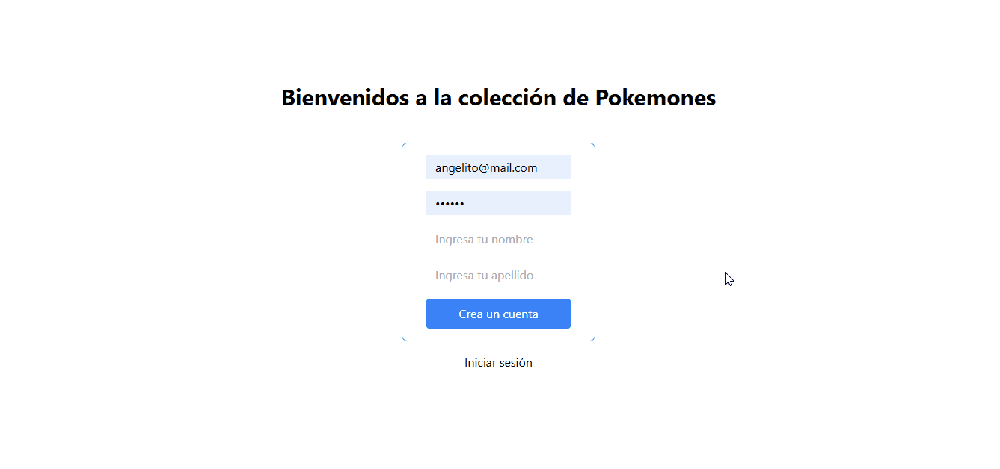
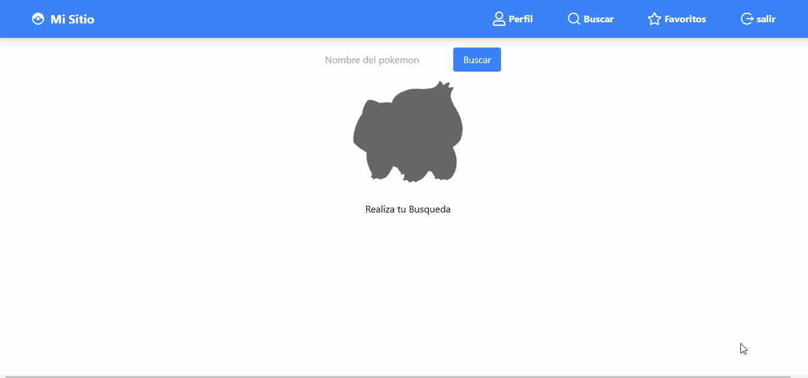

# 🌟 POKEMON FAVORITO

## _Esta aplicación permite a los usuarios explorar un catálogo de Pokémon obtenido de una API externa pública. Desde la página principal, los usuarios pueden buscar Pokémon, visualizar información detallada y añadirlos o quitarlos de su lista de favoritos. La funcionalidad de favoritos es completamente interactiva y dinámica, permitiendo gestionar la lista de manera instantánea y sin restricciones en la cantidad de Pokémon favoritos. Además esta aplicación es responsiva para distintos dispositivos moviles, tablet y pc._

Adicionalmente, la aplicación incluye un sistema de autenticación que permite a los usuarios registrarse y crear una cuenta personalizada. Esto asegura que cada usuario tenga acceso exclusivo a su propia lista de favoritos, brindando una experiencia más personalizada y segura.

La combinación de interacción con la API y la gestión de cuentas personales hace de esta aplicación una herramienta completa para los fanáticos de Pokémon.


## Características

- **Login seguro**: Acceso a la página principal mediante el ingreso de usuario y contraseña. Además, los usuarios pueden crear una cuenta nueva para acceder a la aplicación.
- **Buscar**: Los usuarios registrados pueden acceder a la página de búsqueda (searchPage) para encontrar información detallada sobre cualquier Pokémon disponible en la API pública.
- **Agregar**: Una vez encontrado el Pokémon deseado, se puede agregar a la página de favoritos mediante un botón dedicado.
- **Quitar**: Desde la página de favoritos, los usuarios pueden regresar a la página de búsqueda (searchPage), seleccionar un Pokémon y quitarlo de la lista de favoritos. Esto actualiza automáticamente el contenido del componente de favoritos.


## 📋 Instalación

1. **Clona el repositorio**:

   ```bash
  git@github.com:juan-arango35/poke-favorito.git

   cd nombre_del_proyecto
   npm install
   npm run dev
   

## Proceso
- **Login seguro**: Permite crear un usuario proporcionando los campos de correo electrónico (email), contraseña, nombre (firstname) y apellido (lastname). Una vez registrado, los usuarios pueden iniciar sesión solo con su correo electrónico y contraseña. Si se ingresa información incorrecta, el sistema mostrará un mensaje de "Credenciales inválidas". Los usuarios con rol de admin tienen acceso completo a todas las rutas de la aplicación.
<p align="center">

</p>

- **Buscar**: Los usuarios registrados pueden acceder a la página de búsqueda (searchPage), donde tienen la posibilidad de consultar información detallada sobre cualquier Pokémon disponible en la API pública de PokeAPI. La búsqueda puede realizarse ingresando el nombre o número del Pokémon en un campo de texto. Al enviar la consulta, la aplicación se comunica con la API para obtener y mostrar datos relevantes, como su tipo, habilidades, estadísticas y una imagen representativa. Esta funcionalidad permite explorar el amplio catálogo de Pokémon de manera interactiva y eficiente, brindando una experiencia enriquecedora para los usuarios.


- **Agregar**: Una vez que el usuario encuentra el Pokémon deseado mediante la búsqueda, puede agregarlo a su lista personal de favoritos con un botón dedicado. Al hacer clic en este botón, el Pokémon seleccionado se guarda en la sección de favoritos, la cual es accesible desde un componente específico de la aplicación. Esta funcionalidad permite a los usuarios crear y gestionar su colección personalizada de Pokémon favoritos de manera sencilla e intuitiva. Además, la lista de favoritos se actualiza automáticamente, reflejando los cambios sin necesidad de recargar la página.
<p align="center">

</p>

- **Quitar**: Desde la página de favoritos, los usuarios pueden gestionar su colección personalizada eliminando Pokémon que ya no deseen conservar. Para ello, pueden regresar a la página de búsqueda (searchPage), localizar el Pokémon que desean eliminar y utilizar un botón específico para quitarlo de su lista de favoritos. Al realizar esta acción, la aplicación actualiza automáticamente el contenido de la sección de favoritos, reflejando los cambios en tiempo real sin necesidad de recargar la página. Esto garantiza una experiencia fluida y eficiente para los usuarios al administrar su colección.
<p align="center">

</p>

- **Responsivo**: La aplicación está diseñada para adaptarse a cualquier dispositivo, proporcionando una experiencia fluida tanto en pantallas grandes como en dispositivos móviles. Desde la página de favoritos, los usuarios pueden gestionar su colección personalizada eliminando Pokémon que ya no deseen conservar. Para ello, pueden regresar a la página de búsqueda (searchPage), localizar el Pokémon que desean eliminar y utilizar un botón específico para quitarlo de su lista de favoritos.
Además, la aplicación cuenta con un menú desplegable intuitivo que facilita la navegación hacia las diferentes rutas disponibles, como la página de búsqueda, favoritos o cualquier otra sección. Este menú mejora la experiencia del usuario al permitir un acceso rápido y organizado a las funcionalidades clave de la aplicación.
<p align="center">

</p>


  ## Tecnologías Usadas

- **React**: desarrollo de la interfaz de usuario.
- **Vite**: herramienta de desarrollo rápida y ligera para el empaquetado de la aplicación.
- **Tailwind CSS**: estilización rápida y modular.
- **React Router DOM**: manejo de rutas en la aplicación.
- **React Icons**: iconos personalizados para mejorar la experiencia visual.

## Agradecimientos

  Queremos agradecer a todos aquellos que han contribuido con su tiempo y apoyo a este proyecto, ya sea con retroalimentación, pruebas o aportes técnicos. Gracias por ayudar a hacer que este proyecto cobre vida.

## Estado del Proyecto

Este proyecto aún se encuentra en proceso de culminación. Próximas mejoras y funcionalidades adicionales están en desarrollo para optimizar la experiencia del usuario y asegurar un sistema robusto.


## Demo
Puedes ver el demo del proyecto aquí: [Ver Demo](https://pokemonsearch1.netlify.app/)